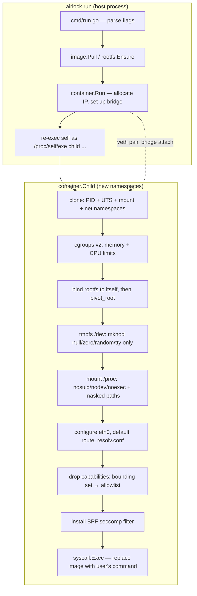

## Project Airlock

[](https://github.com/kelyonn/airlock/actions/workflows/ci.yml)
[](go.mod)
[](LICENSE)

### Objective

To demystify containerization by building a functional container runtime from scratch in Go. Airlock securely sandboxes a Linux process using the same primitives Docker is built on, proving that containers are just isolated processes — not virtual machines.

This is not a Docker replacement and isn't trying to be. It's what's underneath one, built by hand: namespaces, `pivot_root`, cgroups v2, a hand-assembled BPF seccomp filter, and a native OCI registry client, with no libcontainer/libseccomp/runc dependency anywhere in the stack.

---

### Architecture



The host process and the container's PID-1 process are the *same binary*, re-executed with `child` as `argv[0]` — Go can't `fork()` safely (goroutines, the runtime scheduler, and cgo state don't survive a bare fork), so a fresh `exec` into new namespaces is the standard workaround (it's what `runc` does too, via a C constructor; airlock does it more simply because it doesn't need to fork before namespaces are configured).

---

### What actually happens when you run `airlock run alpine:3.20 /bin/sh`

1. **`image.Pull`** parses `alpine:3.20` into a registry/repo/tag triple, checks `~/.airlock/images/.../.airlock-pulled`, and on a cache miss: gets a Docker Hub bearer token, fetches the manifest (resolving a multi-arch manifest list down to `linux/$GOARCH` if needed), downloads each layer blob, **verifies its SHA-256 against the digest the registry claimed** before it's ever written to the cache, and extracts the tarballs in order onto a fresh rootfs directory, applying OCI whiteout (`.wh.*`) semantics as it goes.
2. **`container.Run`** brings up the `airlock0` Linux bridge (idempotent), allocates a free IP in `10.0.42.0/24` (under an flock, cross-checked against every currently-live container's actual IP — not just an incrementing counter), and re-execs `/proc/self/exe child <serialized config> ...` with `CLONE_NEWUTS|CLONE_NEWPID|CLONE_NEWNS|CLONE_NEWNET`.
3. **`container.Child`**, now running as PID 1 inside the new namespaces: sets the hostname, writes cgroup v2 limits, bind-mounts the rootfs onto itself (a `pivot_root` prerequisite), `pivot_root`s into it, builds a *minimal* `/dev` from a fresh tmpfs (just `null`/`zero`/`full`/`random`/`urandom`/`tty` — not a bind-mount of the host's `/dev`), mounts a hardened `/proc`, configures `eth0` and DNS, **drops Linux capabilities down to an allowlist**, installs the seccomp filter, and finally `execve`s the user's command — which now sees itself as PID 1 in an empty, isolated world.
4. Back on the host, `container.Run` creates the veth pair connecting the new network namespace to the bridge — over a direct netlink socket into that namespace (via its `/proc/<pid>/ns/net` file descriptor), not a shelled-out `ip`/`nsenter` call — which has to happen *after* the child exists, so that file exists to target. It then registers the container in `~/.airlock/containers.json` and blocks on `cmd.Wait()`.

---

### Usage: Running Containers

```bash
# Build the runtime
go build -o airlock .

# Pull and run an OCI image from Docker Hub
airlock run ubuntu:24.04 /bin/bash -c "echo hello"

# Run a web server and publish a port (Host:Container)
airlock run -p 8080:80 nginx:alpine /docker-entrypoint.sh nginx -g "daemon off;"

# Legacy mode: run a command using the built-in Alpine mini-rootfs
airlock run /bin/sh

# Mount volumes (read-write or read-only)
airlock run -v /host/path:/container/path /bin/sh
airlock run -v /host/data:/data:ro /bin/sh

# Custom resource limits
airlock run --memory 256m --cpu 75 alpine:3.20 /bin/sh

# Run completely offline, without a network namespace
airlock run --no-network alpine:3.20 /bin/sh

# See the full setup narration (namespaces, bridge, veth, seccomp) instead
# of the quiet default
airlock run --verbose alpine:3.20 /bin/sh
```

---

### Usage: Multi-Container Orchestration

Airlock includes a built-in orchestrator (similar to `docker-compose`) that parses an `airlock-compose.yml` file, topologically sorts services by `depends_on`, pre-allocates IPs, and writes internal `/etc/hosts` records so containers can resolve each other by service name.

```yaml
version: "1.0"
services:
  database:
    image: redis:alpine
    command: redis-server
    memory: 256m

  web:
    image: nginx:alpine
    # Either a shell-like string (quote-aware — this is parsed correctly,
    # not split on whitespace) or an explicit list:
    command: nginx -g "daemon off;"
    # command: ["nginx", "-g", "daemon off;"]
    ports:
      - "8080:80"
    environment:
      - LOG_LEVEL=info
    depends_on:
      - database
```

```bash
# Start all services in dependency order, blocking in the foreground —
# Ctrl+C tears the whole stack down (like `docker-compose up`)
airlock compose up

# Or detach and return immediately
airlock compose up -d

# Stop and remove every container in the stack
airlock compose down

# List running containers and their service names
airlock ps
```

Each service in a stack runs as an independent, detached OS process (not a goroutine tied to the orchestrator's lifetime), with its own stdout/stderr captured to `~/.airlock/logs/<stack-hash>/<service>.log`. `compose up` waits for each service to actually register itself as running before starting the next one, and returns a real error — instead of silently continuing — if a service fails to come up.

---

### Usage: Container Lifecycle

`CONTAINER` in any of these can be the full ID or any unique prefix of it — the same short ID `airlock ps` prints.

```bash
# Run a command inside an already-running container (like `docker exec`)
airlock exec CONTAINER sh
airlock exec CONTAINER ls -la /app

# View a container's stdout/stderr — captured for every container's whole
# lifetime, not just while you're attached to it, and kept after it exits
# until `airlock clean --all` removes it
airlock logs CONTAINER
airlock logs -f CONTAINER   # keep streaming new output, like tail -f

# Stop one or more running containers (SIGTERM, then SIGKILL after 5s)
airlock stop CONTAINER [CONTAINER...]
```

`airlock exec` shells out to `nsenter(1)` rather than joining namespaces natively — worth calling out, since the rest of this project goes out of its way to avoid exactly that (see the netlink migration above). Joining a *mount* namespace via `setns(2)` has a hard kernel requirement that the calling process be single-threaded, which no Go binary ever is (the runtime always spawns extra OS threads for GC/scheduling before `main()` even runs). Solving that in pure Go means a cgo constructor that runs before the Go runtime initializes — literally how `runc`'s own nsenter component is built. Taking on a cgo dependency for one command was a worse trade than shelling out to a small, correct, nearly-universal-on-Linux tool built to solve exactly this.

---

### Usage: Housekeeping

```bash
# List all running containers
airlock ls

# Clean up the default Alpine rootfs cache and stale state files
airlock clean

# Clean up pulled OCI image layers and blobs
airlock clean --images

# Re-hash every cached blob against its digest and drop any that fail —
# useful after a suspicious download or disk issue
airlock clean --verify

# Nuke the entire ~/.airlock directory
airlock clean --all
```

---

### Security model & limitations

Airlock demonstrates the primitives; it does not claim production-grade isolation. Concretely, as of this version:

- **No user namespaces, by default.** The container's PID 1 runs as the *real* host UID 0 — there's no `CLONE_NEWUSER` uid/gid remapping. What actually restricts it is a narrowed Linux capability bounding set (see below) plus namespace/mount/seccomp isolation, not "not being root." A `--userns` flag exists and correctly creates the namespace with a proper UID/GID mapping (container root → an unprivileged host UID, verifiable via `/proc/self/uid_map`) — but the container's filesystem setup fails immediately after, because `bindRootfsToSelf`/`pivot_root` need `CAP_SYS_ADMIN` in the user namespace that owns the target filesystem's *superblock*, not just file-level permission on the path. airlock's rootfs sits on the host's real filesystem, whose superblock belongs to the *initial* user namespace; a `--userns` container's mapped-root process only holds `CAP_SYS_ADMIN` in its own new namespace, so the mount is refused regardless of ownership. This is the same reason rootless Podman/Docker use a FUSE-backed overlay filesystem instead of plain kernel `mount()`/`pivot_root()` for their rootfs. A real fix means mounting the rootfs from a filesystem created *after* (and owned by) the new user namespace — a genuine architecture change, not a one-line patch. See `container/namespaces.go`'s comment at the `bindRootfsToSelf` call for the full explanation.
- **Capabilities are dropped to Docker's own default allowlist** (`CAP_CHOWN`, `CAP_DAC_OVERRIDE`, `CAP_FOWNER`, `CAP_FSETID`, `CAP_KILL`, `CAP_SETGID`, `CAP_SETUID`, `CAP_SETPCAP`, `CAP_NET_BIND_SERVICE`, `CAP_NET_RAW`, `CAP_SETFCAP`, `CAP_SYS_CHROOT`, `CAP_MKNOD`, `CAP_AUDIT_WRITE`) via `PR_CAPBSET_DROP` on every other capability — notably `CAP_SYS_ADMIN`, `CAP_SYS_MODULE`, `CAP_SYS_RAWIO`, `CAP_SYS_BOOT`, `CAP_NET_ADMIN`, `CAP_SYS_PTRACE`.
- **Seccomp is a curated deny-list, not an allow-list.** Eight specific syscalls (`reboot`, `kexec_load`, `swapon`/`swapoff`, `mount`, `pivot_root`, `settimeofday`, `perf_event_open`) are blocked; everything else the kernel exposes is reachable. This is meaningfully weaker than the ~40-syscall allow-list Docker's default seccomp profile uses.
- **No image signature verification.** Layer *integrity* is checked (SHA-256 against the digest the registry returned), but there's no Docker Content Trust / Sigstore-style verification of *provenance* — a compromised registry serving a correctly-hashed malicious layer is not detected.
- **`/dev` is a minimal tmpfs**, not a bind-mount of the host's `/dev` — deliberately: with no user namespace, a bind-mounted host `/dev` would hand the container's root direct read/write access to host block devices.
- Not intended for hostile/untrusted workloads or multi-tenant use. Treat it the way you'd treat `chroot` plus some extra locks, not a security boundary you'd put between two mutually-distrusting parties.

---

### Debugging notes

**The Docker Desktop seccomp deadlock.** On Docker Desktop (Mac/Windows), containers run inside a lightweight `linuxkit` VM. Installing a seccomp filter there — `prctl(PR_SET_SECCOMP)` — triggers a kernel-level RCU synchronization deadlock: `synchronize_rcu()` blocks waiting for all CPUs to pass through a quiescent state, and on a single-vCPU VM (common in dev/debug configurations) that never happens, because the one CPU is the one doing the blocking. The whole VM freezes — not just the container, every goroutine in the process, including timers and signal handlers. Airlock detects `linuxkit` via `/proc/version` and skips seccomp with a warning instead of hanging indefinitely; the BPF filter installs normally on real Linux (bare metal, EC2, GCP, any cloud VM with more than one vCPU).

**Two concurrency bugs found under load.** Starting several containers back-to-back (a compose stack, or just scripted `airlock run` calls in quick succession) surfaced two races: veth interface names colliding when two containers' short IDs happened to collide, and unlocked read-modify-write access to the JSON state files. Both are fixed by keying veth names off the kernel-guaranteed-unique child PID instead of a truncated hash, and by taking an exclusive `flock` around every state-file read-modify-write cycle (`internal/filelock`) — including, later, IP allocation, which had the same bug: a bare incrementing counter with no lock and no cross-check against which IPs were actually still in use by live containers.

**`pivot_root` and `MS_REC`.** Bind-mounting the rootfs onto itself (a `pivot_root` prerequisite) deliberately does *not* use `MS_REC`. When the source and destination of a bind mount are the same path and submounts already exist under it, the kernel walks the submount tree while holding `namespace_sem`, which under some kernel/cgroup-driver combinations turns into lock contention severe enough to look like a hang.

**Concurrent containers sharing one filesystem.** `image.Pull` caches an image's extracted rootfs once, at a single path keyed by image reference. Early on, every container run from that image `pivot_root`ed directly into that same shared directory — two containers from the same image running concurrently (two replicas in a compose stack, or just two overlapping `airlock run` calls) would see and corrupt each other's writes to it. Fixed by giving each container its own overlayfs view: the shared cache stays a read-only lowerdir, and every container gets a fresh, private upperdir for its own writes (`container/overlay.go`). Falls back to the old shared-directory behavior if overlayfs itself isn't available (e.g. testing airlock inside a Docker container whose own root is already overlayfs — stacking overlay-on-overlay is restricted on many kernels; a bare-metal or cloud VM host doesn't hit this). A related, still-open one: two containers pulling the *same currently-uncached* image at the same moment can race on that image's layer extraction — there's no per-image lock around the pull path yet, only around the already-cached case.

**Replacing `ip`/`iptables`/`nsenter` shell-outs with netlink.** The original network setup shelled out to four separate binaries per container start, trusting exit codes and parsing nothing. Bridge/veth/address/route setup is now done over a direct `AF_NETLINK` socket (`github.com/vishvananda/netlink`) — including configuring the container's own `eth0`, loopback, and default route from the *host* side via a netlink handle bound to the container's network namespace (`netlink.NewHandleAt`), instead of `nsenter`-ing in to run `ip` commands. That also incidentally removed the eth0 setup race this README used to describe here: the interface is fully configured, synchronously, as part of veth creation, before the container's own init code ever gets a chance to look for it — no more retry loop guessing whether the parent has "gotten to it yet". iptables rules (MASQUERADE, DNAT, FORWARD) still go through the `iptables` binary via `github.com/coreos/go-iptables` — there's no mature pure-Go netfilter/iptables implementation to swap in without a much larger nftables rewrite — so that one dependency remains, down from four.

---

### Seccomp: Blocked Syscalls

The BPF filter is architecture-specific (`seccomp_linux_amd64.go` / `seccomp_linux_arm64.go`) — an earlier single shared implementation hardcoded the x86_64 `AUDIT_ARCH` value, so the architecture check failed on every syscall on an arm64 host and the filter's default-deny branch killed every container instantly. On any other Linux architecture, seccomp is skipped with a warning rather than installed with a wrong-arch filter that would kill everything.

| Syscall | Reason |
|---|---|
| `reboot` | Rebooting the host from inside a container |
| `kexec_load` | Loading a new kernel image |
| `swapon` / `swapoff` | Manipulating swap devices |
| `mount` | Remounting host filesystems |
| `pivot_root` | Escaping the container root |
| `settimeofday` | Manipulating the system clock |
| `perf_event_open` | Side-channel attacks via perf |
| `mknod` / `mknodat` | Creating new device nodes after `/dev` setup (`mknod` only exists as a distinct syscall on amd64; arm64 only has `mknodat`) |

---

### Testing

```bash
# Unit tests (pure logic: reference parsing, whiteout extraction, topo
# sort, shellwords, volume/memory spec parsing) — run anywhere, no
# privileges needed
go test ./... -race -cover

# Full 40-step End-to-End suite — needs real Linux namespaces/cgroups, so
# it runs inside a privileged container
docker build -t airlock-dev .
docker run --rm --privileged airlock-dev bash /app/test_e2e.sh
```

CI (`.github/workflows/ci.yml`) runs `go vet`, the unit test suite under the race detector, `golangci-lint`, a cross-compile matrix (`linux/amd64`, `linux/arm64`, `darwin/arm64`), and the full privileged-Docker E2E suite on every push.

---

### Development: Docker Desktop

To develop or test on macOS/Windows, build the dev image and run it `--privileged`:

```bash
docker build -t airlock-dev .
docker run --rm -it --privileged airlock-dev bash
```

See [Debugging notes](#debugging-notes) above for why seccomp auto-skips inside Docker Desktop specifically.
