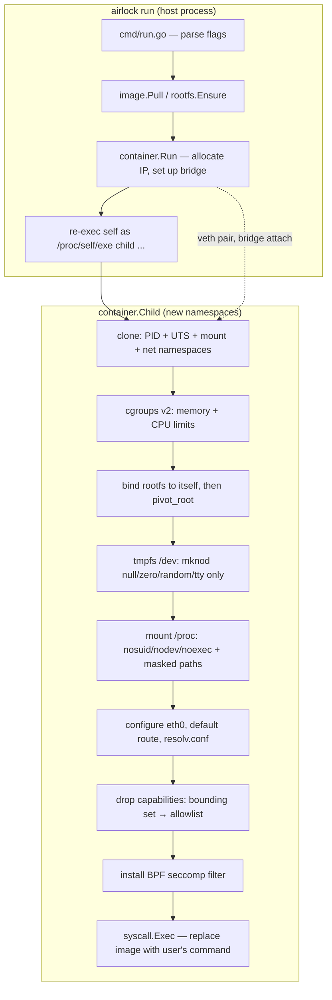

## Project Airlock

[](https://github.com/kelyonn/airlock/actions/workflows/ci.yml)
[](go.mod)
[](LICENSE)

### Objective

To demystify containerization by building a functional container runtime from scratch in Go. Airlock securely sandboxes a Linux process using the same primitives Docker is built on, proving that containers are just isolated processes — not virtual machines.

This is not a Docker replacement and isn't trying to be. It's what's underneath one, built by hand: namespaces, `pivot_root`, cgroups v2, a hand-assembled BPF seccomp filter, and a native OCI registry client, with no libcontainer/libseccomp/runc dependency anywhere in the stack.

---

### Architecture



The host process and the container's PID-1 process are the *same binary*, re-executed with `child` as `argv[0]` — Go can't `fork()` safely (goroutines, the runtime scheduler, and cgo state don't survive a bare fork), so a fresh `exec` into new namespaces is the standard workaround (it's what `runc` does too, via a C constructor; airlock does it more simply because it doesn't need to fork before namespaces are configured).

---

### What actually happens when you run `airlock run alpine:3.20 /bin/sh`

1. **`image.Pull`** parses `alpine:3.20` into a registry/repo/tag triple, checks `~/.airlock/images/.../.airlock-pulled`, and on a cache miss: gets a Docker Hub bearer token, fetches the manifest (resolving a multi-arch manifest list down to `linux/$GOARCH` if needed), downloads each layer blob, **verifies its SHA-256 against the digest the registry claimed** before it's ever written to the cache, and extracts the tarballs in order onto a fresh rootfs directory, applying OCI whiteout (`.wh.*`) semantics as it goes.
2. **`container.Run`** brings up the `airlock0` Linux bridge (idempotent), allocates a free IP in `10.0.42.0/24` (under an flock, cross-checked against every currently-live container's actual IP — not just an incrementing counter), and re-execs `/proc/self/exe child <serialized config> ...` with `CLONE_NEWUTS|CLONE_NEWPID|CLONE_NEWNS|CLONE_NEWNET`.
3. **`container.Child`**, now running as PID 1 inside the new namespaces: sets the hostname, writes cgroup v2 limits, bind-mounts the rootfs onto itself (a `pivot_root` prerequisite), `pivot_root`s into it, builds a *minimal* `/dev` from a fresh tmpfs (just `null`/`zero`/`full`/`random`/`urandom`/`tty` — not a bind-mount of the host's `/dev`), mounts a hardened `/proc`, configures `eth0` and DNS, **drops Linux capabilities down to an allowlist**, installs the seccomp filter, and finally `execve`s the user's command — which now sees itself as PID 1 in an empty, isolated world.
4. Back on the host, `container.Run` creates the veth pair connecting the new network namespace to the bridge — over a direct netlink socket into that namespace (via its `/proc/<pid>/ns/net` file descriptor), not a shelled-out `ip`/`nsenter` call — which has to happen *after* the child exists, so that file exists to target. It then registers the container in `~/.airlock/containers.json` and blocks on `cmd.Wait()`.

---

### What this is for

Airlock isn't meant to replace Docker, and it shouldn't be pointed at anything you actually depend on — see "Security model & limitations" below for exactly where it falls short of that. What it's for is demonstrating, concretely and by hand, an understanding of what a container runtime is actually doing underneath `docker run`: namespaces, cgroups, seccomp, overlayfs, netlink, the OCI registry protocol. That's a different and more specific claim than "knows the `docker` CLI," and it's meant to be legible as such — a portfolio/interview artifact, not a tool.

The debugging notes below aren't incidental — they're arguably the more interesting half of the project. Building the features means following documentation; hitting (and correctly diagnosing) things like the `mount()` superblock-ownership rule for user namespaces, or PID 1's kernel-enforced habit of silently dropping any signal it hasn't explicitly handled, means reasoning about a real system from its actual behavior. Each entry in "Debugging notes" is a small case study in that: an assumption that seemed reasonable, a symptom that didn't match it, and a fix grounded in the kernel semantics rather than a workaround.

### Guided Demo Walkthrough

A suggested order for showing this off, front-loading the most convincing evidence first. `--no-seccomp` appears in the early, throwaway examples purely because seccomp deadlocks under Docker Desktop's single-vCPU `linuxkit` VM (see "Debugging notes"); it's on by default and demonstrated for real in Act 4.

**Act 1 — real isolation, not just a chroot with extra steps**
```bash
airlock run --no-seccomp alpine:3.20 sh -c 'echo pid=$$; hostname; cat /etc/os-release'
```
PID 1, its own hostname, its own filesystem — all from one process, no VM.

**Act 2 — the real OCI/Docker Hub registry protocol**
```bash
airlock run --no-seccomp nginx:alpine
```
No hardcoded rootfs: this resolves a multi-arch manifest list for your platform, verifies every layer blob's SHA-256 against the digest the registry claimed, and falls back to the image's own `ENTRYPOINT`/`CMD` with no command given.

**Act 3 — networking over raw netlink, not `ip`/`nsenter` shell-outs**
```bash
airlock run --no-seccomp -p 8080:80 nginx:alpine &
curl localhost:8080
```
A container with its own bridged IP, reachable through a real DNAT port-forward, built on `AF_NETLINK` sockets — the same underlying mechanism containerd itself uses. Verified end-to-end from genuinely external traffic (curling the machine airlock runs on from a *different* one — real client IP, correctly logged by the container), and `curl localhost:PORT` from the exact same machine (hairpin/loopback NAT) now has an automated e2e assertion (`test_e2e.sh` PHASE 5.8) and genuinely passes — see "Debugging notes" for the second fix that turned out to be needed beyond `route_localnet`.

**Act 4 — the security story, and the best single demo beat in the project**

Needs real Linux (bare metal or a cloud VM), not the Docker Desktop dev sandbox below — Docker Desktop's `linuxkit` VM is exactly where airlock deliberately *skips* installing seccomp at all, to dodge a kernel deadlock (see "Debugging notes"), so this specific contrast won't show up there.

```bash
# seccomp specifically, isolated from capability-dropping: mknod stays
# CAP_MKNOD-allowed in airlock's capability bounding set either way, so
# only seccomp's own syscall filter decides the outcome here — mount
# would be a worse example, since CAP_SYS_ADMIN is already stripped from
# that bounding set regardless of seccomp, and would fail either way.
airlock run alpine:3.20 sh -c 'mknod /tmp/d c 1 3 && echo created'              # denied
airlock run --no-seccomp alpine:3.20 sh -c 'mknod /tmp/d c 1 3 && echo created'  # created, for contrast

# user namespaces: root inside, an unprivileged UID outside — same
# process, two vantage points
airlock run --userns alpine:3.20 sleep 30 &
sleep 2
CID=$(airlock ps | tail -1 | awk '{print $1}')
grep Uid: /proc/"$CID"/status   # host UID — not root, e.g. 165536
airlock exec "$CID" id          # uid=0(root) — same process, different namespace
```
That last pair is worth pausing on: it's the entire point of user namespaces made visible in ten seconds, and it's this project's own code doing the UID mapping and the per-container range allocation (see "Security model & limitations"), not something borrowed from a library.

**Act 5 — multi-container orchestration**
```bash
airlock compose up
```
Dependency-ordered startup (`db` before `app`), pre-allocated IPs, and working service-name DNS between containers from a stack file — not single-container-only.

**Act 6 — lifecycle parity with `docker`'s own UX**
```bash
airlock run --init redis:alpine &
sleep 2
CID=$(airlock ps | tail -1 | awk '{print $1}')
airlock exec "$CID" redis-cli ping
airlock logs "$CID"
airlock stop "$CID"
```

One thing worth saying out loud during Act 4 or 6, since it's the kind of nuance that reads as more senior than skipping it: `--init` is an explicit opt-in, not the default, because without it the container's command genuinely *is* PID 1 — which some tooling depends on — at the cost of the kernel silently dropping any signal it hasn't installed a handler for. `airlock stop` still works either way (it escalates to `SIGKILL` after a timeout), just not always gracefully without `--init`. See "Debugging notes" for how that was actually found: a background shell loop that ran straight through `Ctrl+C`.

---

### Usage: Running Containers

```bash
# Build the runtime
go build -o airlock .

# Pull and run an OCI image from Docker Hub
airlock run ubuntu:24.04 /bin/bash -c "echo hello"

# Run a web server and publish a port (Host:Container)
airlock run -p 8080:80 nginx:alpine /docker-entrypoint.sh nginx -g "daemon off;"

# Legacy mode: run a command using the built-in Alpine mini-rootfs
airlock run /bin/sh
# Interactive shells like this get a distinct prompt (🔒 airlock
# <hostname>:<cwd>#) and terminal tab title, so it's obvious at a glance
# which shell — host or container — a command is about to run in.

# Mount volumes (read-write or read-only)
airlock run -v /host/path:/container/path /bin/sh
airlock run -v /host/data:/data:ro /bin/sh

# Custom resource limits
airlock run --memory 256m --cpu 75 alpine:3.20 /bin/sh

# Run completely offline, without a network namespace
airlock run --no-network alpine:3.20 /bin/sh

# See the full setup narration (namespaces, bridge, veth, seccomp) instead
# of the quiet default
airlock run --verbose alpine:3.20 /bin/sh

# Run under a minimal init so Ctrl+C / SIGTERM actually reach a command
# that never installed its own signal handler (a plain `sleep`, most
# simple scripts) — without this, the command is PID 1 itself, and the
# kernel silently drops any signal it hasn't explicitly handled. The
# trade-off: the command is no longer PID 1. Same idea as `docker run
# --init`; `airlock stop` works either way, just not always gracefully
# without this. See "Security model & limitations" below for the details.
airlock run --init alpine:3.20 sleep 300

# Isolate with a user namespace: container root maps to an unprivileged
# host UID instead of real root
airlock run --userns alpine:3.20 /bin/sh
```

---

### Usage: Multi-Container Orchestration

Airlock includes a built-in orchestrator (similar to `docker-compose`) that parses an `airlock-compose.yml` file, topologically sorts services by `depends_on`, pre-allocates IPs, and writes internal `/etc/hosts` records so containers can resolve each other by service name.

```yaml
version: "1.0"
services:
  database:
    image: redis:alpine
    command: redis-server
    memory: 256m

  web:
    image: nginx:alpine
    # Either a shell-like string (quote-aware — this is parsed correctly,
    # not split on whitespace) or an explicit list:
    command: nginx -g "daemon off;"
    # command: ["nginx", "-g", "daemon off;"]
    ports:
      - "8080:80"
    environment:
      - LOG_LEVEL=info
    depends_on:
      - database
```

```bash
# Start all services in dependency order, blocking in the foreground —
# Ctrl+C tears the whole stack down (like `docker-compose up`)
airlock compose up

# Or detach and return immediately
airlock compose up -d

# Stop and remove every container in the stack
airlock compose down

# List running containers and their service names
airlock ps
```

Each service in a stack runs as an independent, detached OS process (not a goroutine tied to the orchestrator's lifetime), with its own stdout/stderr captured to `~/.airlock/logs/<stack-hash>/<service>.log`. `compose up` waits for each service to actually register itself as running before starting the next one, and returns a real error — instead of silently continuing — if a service fails to come up.

---

### Usage: Container Lifecycle

`CONTAINER` in any of these can be the full ID or any unique prefix of it — the same short ID `airlock ps` prints.

```bash
# Run a command inside an already-running container (like `docker exec`)
airlock exec CONTAINER sh
airlock exec CONTAINER ls -la /app

# View a container's stdout/stderr — captured for every container's whole
# lifetime, not just while you're attached to it, and kept after it exits
# until `airlock clean --all` removes it
airlock logs CONTAINER
airlock logs -f CONTAINER   # keep streaming new output, like tail -f

# Stop one or more running containers (SIGTERM, then SIGKILL after 5s)
airlock stop CONTAINER [CONTAINER...]
```

`airlock exec` shells out to `nsenter(1)` rather than joining namespaces natively — worth calling out, since the rest of this project goes out of its way to avoid exactly that (see the netlink migration above). Joining a *mount* namespace via `setns(2)` has a hard kernel requirement that the calling process be single-threaded, which no Go binary ever is (the runtime always spawns extra OS threads for GC/scheduling before `main()` even runs). Solving that in pure Go means a cgo constructor that runs before the Go runtime initializes — literally how `runc`'s own nsenter component is built. Taking on a cgo dependency for one command was a worse trade than shelling out to a small, correct, nearly-universal-on-Linux tool built to solve exactly this.

---

### Usage: Housekeeping

```bash
# List all running containers
airlock ls

# Clean up the default Alpine rootfs cache and stale state files
airlock clean

# Clean up pulled OCI image layers and blobs
airlock clean --images

# Re-hash every cached blob against its digest and drop any that fail —
# useful after a suspicious download or disk issue
airlock clean --verify

# Nuke the entire ~/.airlock directory
airlock clean --all
```

---

### Security model & limitations

Airlock demonstrates the primitives; it does not claim production-grade isolation. Concretely, as of this version:

- **No user namespaces by default; `--userns` opts in.** Without it, the container's PID 1 runs as the *real* host UID 0 — no `CLONE_NEWUSER` remapping. What restricts it is a narrowed Linux capability bounding set (see below) plus namespace/mount/seccomp isolation, not "not being root." With `--userns`, container UID 0 maps to an unprivileged host UID (`userNSHostIDOffset`, currently a fixed 100000): verified by reading `/proc/<pid>/status` from the *host* side while the container runs — `Uid: 100000 100000 100000 100000` outside, `uid=0(root)` inside the same process. That gap is the actual security property: a process root-owned files, other host processes, or `CAP_SYS_ADMIN`-gated resources it doesn't already have permission for, are all off limits, regardless of what it thinks its own UID is.

  Getting there took more than the namespace + ID mapping. `mount()` (including `MS_BIND`, and `pivot_root` itself) requires `CAP_SYS_ADMIN` in the user namespace that owns the *target filesystem's superblock* — airlock's rootfs sits on the host's real filesystem, owned by the *initial* namespace, so the mapped-root process's `CAP_SYS_ADMIN` in its own namespace doesn't cover it. Every bind-mount that would normally happen inside the container (rootfs-to-itself, volumes, the standard device files) now happens in the **parent** process instead, while it's still real root — `clone(CLONE_NEWUSER)` snapshots the mount table at that moment, so the child's own freshly-cloned mount namespace already has them, without the child ever needing mount privilege it doesn't have. `pivot_root` itself still fails under `--userns` for the same superblock reason; it falls back to `chroot(2)` instead, which checks `CAP_SYS_CHROOT` against the *calling* namespace rather than the target's superblock — and airlock already had that fallback for other reasons (Docker Desktop's linuxkit VM). Worth being honest about the trade-off: a chroot-only root switch is weaker than `pivot_root` (no removal of the old root from the mount namespace), a known, accepted characteristic of this path, not incidental.

  One more permission gap, orthogonal to all of the above: owning the rootfs tree outright (`chownForUserNS`) still wasn't sufficient to *reach* it — every path component is checked separately for search permission, and `~/.airlock` defaults to mode `0700` owned by real root like the rest of a fresh `$HOME`. `ensureTraversableForUserNS` adds the execute ("search") bit — never read or write — to every directory between `$HOME` and the rootfs, so the mapped UID can walk down to something it already owns, without granting any other local user the ability to list or read what's inside `~/.airlock`.

  Each `--userns` container gets its **own** 65536-wide host UID/GID range, not one shared range: range index N covers `[100000 + N*65536, +65536)`, allocated under an `flock` and cross-checked against live containers the same way IP allocation works (`container/userns_alloc.go`), so a container's range is freed by the same `state.List()` pruning that reclaims its IP — including when it's SIGKILLed or its airlock process dies outright, with no explicit release step to strand. That's what makes two `--userns` containers isolated *from each other* by UID and not merely from the host: verified by running three concurrently and reading `/proc/<pid>/status` from the host for each — `165536`, `231072`, `296608`, all reporting `uid=0(root)` inside their own namespace, each one's files owned by a UID none of the others can write as.

  This depends on the container's rootfs actually being private to it, which is what overlayfs provides (the chown lands in that container's own upperdir, invisible to the others). Where overlayfs is unavailable and airlock falls back to running against the shared image cache directly, every container is chowning the *same* tree, so distinct ranges would be worse than one shared range — the second container to start would re-chown the first's running rootfs to a UID it can no longer write as. That path stays on the shared range at index 0 and warns that it isolates from the host but not from other `--userns` containers.

  Remaining trade-off: because the range differs per container, files a container writes into a `-v` bind-mounted host directory are owned by a different host UID each run. Predictable ownership across runs would need something like Docker's `--userns=keep-id`, which airlock doesn't implement.
- **Capabilities are dropped to Docker's own default allowlist** (`CAP_CHOWN`, `CAP_DAC_OVERRIDE`, `CAP_FOWNER`, `CAP_FSETID`, `CAP_KILL`, `CAP_SETGID`, `CAP_SETUID`, `CAP_SETPCAP`, `CAP_NET_BIND_SERVICE`, `CAP_NET_RAW`, `CAP_SETFCAP`, `CAP_SYS_CHROOT`, `CAP_MKNOD`, `CAP_AUDIT_WRITE`) via `PR_CAPBSET_DROP` on every other capability — notably `CAP_SYS_ADMIN`, `CAP_SYS_MODULE`, `CAP_SYS_RAWIO`, `CAP_SYS_BOOT`, `CAP_NET_ADMIN`, `CAP_SYS_PTRACE`.
- **Seccomp is an allow-list**, default-deny (`EPERM`) for everything not explicitly listed — adopted from Docker's own default seccomp profile (the same reference containerd, CRI-O, and most other OCI runtimes converge on) rather than independently curated, for exactly the reason a self-picked list would be risky: this project's own earlier seccomp incident was a wrong default-deny branch instantly killing every container on arm64, and a hand-rolled allow-list risks reproducing that failure mode at far larger scale. Resolving Docker's profile against airlock's own fixed capability set (rather than Docker's per-container `--cap-add`-aware model) and two small, explicitly-stated deviations are covered in `container/seccomp_linux_amd64.go`'s doc comment — most notably that `mknod`/`mknodat` stay blocked even though Docker's own profile allows them, preserving airlock's own prior, deliberate choice (see `capabilities.go`) rather than silently discarding it.
- **No image signature verification.** Layer *integrity* is checked (SHA-256 against the digest the registry returned), but there's no Docker Content Trust / Sigstore-style verification of *provenance* — a compromised registry serving a correctly-hashed malicious layer is not detected.
- **`/dev` is a minimal tmpfs**, not a bind-mount of the host's `/dev` — deliberately: with no user namespace, a bind-mounted host `/dev` would hand the container's root direct read/write access to host block devices.
- Not intended for hostile/untrusted workloads or multi-tenant use. Treat it the way you'd treat `chroot` plus some extra locks, not a security boundary you'd put between two mutually-distrusting parties.

---

### Debugging notes

**The Docker Desktop seccomp deadlock.** On Docker Desktop (Mac/Windows), containers run inside a lightweight `linuxkit` VM. Installing a seccomp filter there — `prctl(PR_SET_SECCOMP)` — triggers a kernel-level RCU synchronization deadlock: `synchronize_rcu()` blocks waiting for all CPUs to pass through a quiescent state, and on a single-vCPU VM (common in dev/debug configurations) that never happens, because the one CPU is the one doing the blocking. The whole VM freezes — not just the container, every goroutine in the process, including timers and signal handlers. Airlock detects `linuxkit` via `/proc/version` and skips seccomp with a warning instead of hanging indefinitely; the BPF filter installs normally on real Linux (bare metal, EC2, GCP, any cloud VM with more than one vCPU).

**Two concurrency bugs found under load.** Starting several containers back-to-back (a compose stack, or just scripted `airlock run` calls in quick succession) surfaced two races: veth interface names colliding when two containers' short IDs happened to collide, and unlocked read-modify-write access to the JSON state files. Both are fixed by keying veth names off the kernel-guaranteed-unique child PID instead of a truncated hash, and by taking an exclusive `flock` around every state-file read-modify-write cycle (`internal/filelock`) — including, later, IP allocation, which had the same bug: a bare incrementing counter with no lock and no cross-check against which IPs were actually still in use by live containers.

**`pivot_root` and `MS_REC`.** Bind-mounting the rootfs onto itself (a `pivot_root` prerequisite) deliberately does *not* use `MS_REC`. When the source and destination of a bind mount are the same path and submounts already exist under it, the kernel walks the submount tree while holding `namespace_sem`, which under some kernel/cgroup-driver combinations turns into lock contention severe enough to look like a hang.

**Concurrent containers sharing one filesystem.** `image.Pull` caches an image's extracted rootfs once, at a single path keyed by image reference. Early on, every container run from that image `pivot_root`ed directly into that same shared directory — two containers from the same image running concurrently (two replicas in a compose stack, or just two overlapping `airlock run` calls) would see and corrupt each other's writes to it. Fixed by giving each container its own overlayfs view: the shared cache stays a read-only lowerdir, and every container gets a fresh, private upperdir for its own writes (`container/overlay.go`). Falls back to the old shared-directory behavior if overlayfs itself isn't available (e.g. testing airlock inside a Docker container whose own root is already overlayfs — stacking overlay-on-overlay is restricted on many kernels; a bare-metal or cloud VM host doesn't hit this). A related bug hit the *pull* itself: two containers pulling the same *currently-uncached* image at the same moment both saw an empty cache and both extracted into it concurrently — reproduced as a "text file busy" mid-extraction and, separately, a container segfaulting on first exec. Fixed with a per-image `flock` around the whole cache-check-through-extract sequence (`internal/filelock`), so a second pull of the same image blocks until the first finishes rather than racing it; verified with four concurrent pulls of the same uncached image.

**Replacing `ip`/`iptables`/`nsenter` shell-outs with netlink.** The original network setup shelled out to four separate binaries per container start, trusting exit codes and parsing nothing. Bridge/veth/address/route setup is now done over a direct `AF_NETLINK` socket (`github.com/vishvananda/netlink`) — including configuring the container's own `eth0`, loopback, and default route from the *host* side via a netlink handle bound to the container's network namespace (`netlink.NewHandleAt`), instead of `nsenter`-ing in to run `ip` commands. That also incidentally removed the eth0 setup race this README used to describe here: the interface is fully configured, synchronously, as part of veth creation, before the container's own init code ever gets a chance to look for it — no more retry loop guessing whether the parent has "gotten to it yet". iptables rules (MASQUERADE, DNAT, FORWARD) still go through the `iptables` binary via `github.com/coreos/go-iptables` — there's no mature pure-Go netfilter/iptables implementation to swap in without a much larger nftables rewrite — so that one dependency remains, down from four.

**Published ports didn't work from the same machine airlock runs on — and the first fix wasn't the whole story.** Found while re-verifying `-p`/`--publish` for this README's demo section, not from a bug report: `airlock run -p 8080:80 nginx:alpine` followed by `curl localhost:8080` on the *same* host timed out, while curling that same container from a genuinely separate machine worked fine. First cause: `SetupPortForward` only ever added a `PREROUTING` DNAT rule, which exists to catch packets *arriving* on a real interface — a locally-generated packet never passes through `PREROUTING` at all, since it originates already past that point, in `OUTPUT`. Fixed with a matching `OUTPUT`-chain DNAT rule plus `net.ipv4.conf.{all,lo,airlock0}.route_localnet=1` — without it, the kernel still refuses to route a loopback-*sourced* packet out a real interface as a martian packet, regardless of what DNAT already rewrote the destination to.

That got the packet *sent* — `iptables -t nat -L -v` showed the rule matching, packet counters incrementing — but `curl` still hung, and `tcpdump` on the bridge interface showed **zero packets ever arriving there**, meaning something between the OUTPUT hook and actual transmission was still dropping it silently. Root cause: DNAT only ever rewrites the *destination* — the packet reaching the container still claimed source `127.0.0.1`, a loopback address arriving on the container's non-loopback `eth0`, and that connection never recovered even with `route_localnet` and `rp_filter` (checked, already `0`) out of the way. The fix was a second `POSTROUTING` `MASQUERADE` rule, `-s 127.0.0.0/8 -d <subnet> -j MASQUERADE`, rewriting the source to the bridge's own address for exactly that narrow case — the same recipe Docker's own bridge driver uses for hairpin NAT. Confirmed by hand this was the missing piece: adding *only* that rule (with the earlier `route_localnet` fix already in place, nothing else changed) took `curl localhost:PORT` from silently hanging to completing normally.

Also worth noting since it very nearly obscured the real bug: this had originally looked like a `linuxkit`-specific quirk (Docker Desktop's dev-sandbox VM already has one confirmed limitation — the seccomp deadlock avoidance below), since that was the only environment it had been tested in. Pushed to CI to check against a genuinely different, non-`linuxkit` environment (GitHub Actions' bare `ubuntu-latest` runner) and it failed there too, identically — ruling out "environment quirk" as the explanation and pointing at the real, environment-independent bug above instead. Now covered by an automated e2e assertion (`test_e2e.sh` PHASE 5.8) that genuinely passes, confirmed both locally and in CI, rather than resting on a one-off manual check.

**Cgroup delegation was failing in CI too, not just the local dev sandbox.** The e2e suite had been silently skipping its own memory-limit checks (`info: could not create a delegated child cgroup`) everywhere it had run — including inside GitHub Actions' own `ubuntu-latest` runner, confirmed directly from a CI log rather than assumed, so this wasn't just a nested-dev-sandbox thing. Root cause: Docker's own default `--cgroupns=private` gives the outer `airlock-dev` container a pre-scoped cgroup namespace rooted at its own cgroup, and nothing had delegated the memory/cpu controllers into that root's own `cgroup.subtree_control` for airlock's `tryCreateChildCgroup` to hand further down. `--cgroupns=host` on the CI (and locally-tested) `docker run` invocation fixes it outright — the container gets the real host cgroup hierarchy directly instead. Confirmed by hand before trusting it: with the flag, a `--memory 16m` container running an unbounded memory-doubling loop now genuinely gets killed well inside a 10-second bound, instead of running unconstrained for the full duration — a new automated e2e assertion (`test_e2e.sh` PHASE 3.3) checks exactly this, and it's what actually caught this working, not a manual one-off check.

**Adopting Docker's own seccomp allow-list instead of hand-picking one, and where it had to diverge.** Converting airlock's 8-syscall deny-list into a real allow-list architecture (default-`EPERM` unless explicitly listed) meant confronting the exact failure mode this project already has a documented incident for: a wrong default-deny branch once killed every container instantly on arm64. Hand-curating a few hundred syscalls from memory risked reproducing that at far larger scale, so the list is adopted from Docker's own default seccomp profile (the reference containerd, CRI-O, and most other OCI runtimes converge on) rather than independently derived — fetched and parsed directly (`moby/moby`'s current `daemon/pkg/oci/fixtures/default.json`; the file had moved since older references to it), not reconstructed from memory. That profile turned out to be considerably more sophisticated than "a flat list": entries are gated on specific capabilities, specific architectures, or specific syscall *argument values* — none of which a flat number-matching BPF filter can represent directly. Resolved by hand rather than guessed at: capability-gated syscalls are included only where airlock's own *fixed* capability bounding set actually grants that capability (a one-time resolution, unlike Docker's own daemon, which has to re-derive this per container since `--cap-add`/`--cap-drop` varies there but never does here) — this is what pulled `chroot` in (`CAP_SYS_CHROOT` is granted) while correctly excluding everything gated on `CAP_SYS_ADMIN` and the dozen or so other capabilities airlock never grants. `clone` and `personality` are gated in Docker's profile on specific argument bitmasks, which needs real per-argument BPF comparison instructions — a genuinely separate, larger piece of BPF assembly than the existing filter's flat number-matching — so both are allowed unconditionally instead, a stated simplification rather than a silent one (and not really optional in practice: `clone` is what `fork()` and every thread creation ultimately lowers to, so *some* allowance for it is load-bearing for any real program). The one deliberate divergence in the other direction: Docker's own profile allows `mknod`/`mknodat` unconditionally, but airlock's capability set keeps `CAP_MKNOD` specifically so images can set up their own `/dev` at startup while relying on seccomp as a second, defense-in-depth layer against creating device nodes afterward (see `capabilities.go`) — adopting Docker's list wholesale here would have silently undone that already-considered choice, so both stay excluded on purpose. The regression signal for whether this list is actually complete enough for real workloads is the existing e2e suite itself, run against the real allow-list rather than `--no-seccomp` — including the `mknod`-specifically-blocked assertion (PHASE 4.3) added this same session, which this change is specifically expected to keep passing unchanged. Can't be checked in the local dev sandbox (seccomp never installs there at all — see the `linuxkit` entry above), so CI's bare-Linux runner is what actually exercises this.

**A mount leak hiding behind a "directory not empty" warning.** Giving each `--userns` container its own UID range (above) meant exercising the overlay teardown path properly for the first time — the dev sandbox runs airlock inside Docker, where overlay-on-overlay is refused, so the fallback had been masking it. Every `--userns` run was leaving an overlay mount in the **host** mount namespace permanently, and printing only a `remove overlay instance dir ...: directory not empty` warning about the leftover directory it also couldn't delete. The cause was two mounts stacked at the same path: `SetupOverlay` mounts the overlay at `merged`, then `bindRootfsToSelf` bind-mounts that onto itself as a `pivot_root` prerequisite (parent-side, for the superblock reason described above) — and cleanup unmounted exactly once. Worse, the first unmount reports `EBUSY` rather than succeeding, so the code fell to its `MNT_DETACH` path and returned, having removed one mount and left the one underneath still mounted and still full of the image's files, which is what the `RemoveAll` then tripped over. Since airlock's parent does this mounting as real root in the initial namespace, nothing tore it down when the container exited: three runs left three permanent entries in `/proc/mounts`. Fixed by looping the unmount until the path reports `EINVAL` ("not a mount point"), continuing after a lazy detach instead of returning. Verified by running 11 containers across `--userns`, volume, and plain configurations and confirming `/proc/mounts` and `~/.airlock/containers` both end exactly where they started.

**PID 1 silently drops unhandled signals — and `--init`'s own fix had a signal-ordering bug.** Confirmed by hand: a plain `sh -c 'while true; ...; sleep 1; done'` loop, and separately a bare `sleep`, both ran straight through `kill -INT` sent to the container's PID, with `airlock stop` (SIGTERM, escalating to SIGKILL) the only thing that reliably worked — the well-known Linux rule that a PID namespace's init drops any signal it hasn't explicitly handled. `--init` (see above) fixes this with a small Go process that stays PID 1 itself and forwards signals to the real command. The first version still didn't work: `runAsInit` called `signal.Notify` *after* starting the child. Since `airlock run ... &` is routinely launched as a backgrounded shell job, and POSIX job control sets SIGINT/SIGQUIT to `SIG_IGN` for backgrounded jobs — a disposition that survives every `execve()` in the re-exec chain, because `exec()` only resets signals with a *handler* back to default, never un-ignores `SIG_IGN` — the child had already forked and inherited that permanent ignore before `Notify` ever ran. The kill(2) call from the init process to the child kept succeeding (no error, no way to tell from the syscall's return value alone), the child just silently dropped what it received. Root-caused by reading `/proc/<child-pid>/status` from inside the namespace mid-hang and finding `SigIgn` had the SIGINT bit set. Fixed by moving `signal.Reset` + `signal.Notify` to before `cmd.Start()`. Verified: `kill -INT` against a `--init` container went from "never terminates" to dying in under 100ms.

**Getting `--userns` from "namespace exists" to "container actually runs."** The namespace and UID mapping were the easy part; the container's own filesystem setup kept failing after that, and the two failures weren't the same bug. First: `bindRootfsToSelf` (a bind-mount, needed as a `pivot_root` prerequisite) returned EPERM even though the rootfs was already `chown`ed to the mapped UID — turned out `mount()` checks `CAP_SYS_ADMIN` against the namespace that owns the *target filesystem's superblock*, not file permissions on the path, and airlock's rootfs sits on a superblock owned by the initial namespace. Fixed by moving every pre-`pivot_root` bind-mount (rootfs-to-self, volumes, device files) into the parent process, while it's still real root — `clone(CLONE_NEWUSER)` snapshots the mount table at that exact moment, so the child inherits them fully mounted and never needs the privilege it doesn't have; `pivot_root` itself still fails the same way and falls back to the `chroot(2)` path airlock already had for other reasons, since `CAP_SYS_CHROOT` is checked against the *caller's* namespace, not the superblock's owner. Second, once that was fixed: `os.MkdirAll` failed on `~/.airlock` itself — several directories *above* the (correctly `chown`ed) rootfs — with plain "permission denied". `~/.airlock` defaults to mode `0700` like the rest of a fresh `$HOME`; owning a directory tree doesn't help if you can't pass through its parents' permission checks to reach it in the first place. Fixed by granting execute-only ("search") permission on the specific ancestor directories between `$HOME` and the rootfs — not read or write, so it doesn't expose the directory *listings* to anyone else on the host, just lets a known path be walked through. Confirmed working end-to-end by comparing `/proc/<pid>/status` from both sides at once: `Uid: 100000 100000 100000 100000` reading it from the host, `uid=0(root)` reading it from inside the same process via `airlock exec`.

---

### Seccomp: Allowed Syscalls

The BPF filter is architecture-specific (`seccomp_linux_amd64.go` / `seccomp_linux_arm64.go`) — an earlier single shared implementation hardcoded the x86_64 `AUDIT_ARCH` value, so the architecture check failed on every syscall on an arm64 host and the filter's default-deny branch killed every container instantly. On any other Linux architecture, seccomp is skipped with a warning rather than installed with a wrong-arch filter that would kill everything.

Default-deny, allow-list architecture: `buildFilter` (`seccomp.go`) allows exactly the syscalls in `allowedSyscalls` and denies (`EPERM`) everything else — 272 entries on amd64, 232 on arm64 (arm64's kernel ABI is deliberately narrower; it never carried forward amd64's 32-bit-compat syscall numbers or the older non-`at`-suffixed path syscalls). Adopted from Docker's own default seccomp profile rather than independently curated — see `seccomp_linux_amd64.go`'s doc comment for exactly how it was resolved against airlock's own fixed capability set, and the two deliberate deviations from Docker's exact profile (most notably `mknod`/`mknodat` staying blocked on purpose, still, matching the reasoning below):

| Dangerous syscall | Why it's still denied under the allow-list |
|---|---|
| `reboot`, `kexec_load`, `swapon`/`swapoff`, `settimeofday`, `perf_event_open`, `mount`, `pivot_root` | Not present in Docker's own default profile at all, or gated there on a capability (`CAP_SYS_ADMIN`, `CAP_SYS_BOOT`, `CAP_SYS_TIME`) airlock's own bounding set doesn't grant — correctly absent from the resolved list without any special-casing needed. |
| `mknod` / `mknodat` | The one deliberate exception to "just adopt Docker's list": Docker's own profile allows these unconditionally, but airlock's capability bounding set keeps `CAP_MKNOD` specifically so images can set up their own tmpfs-backed `/dev` at startup (see `capabilities.go`) — and relies on seccomp as the second, defense-in-depth layer stopping a container from creating device nodes *after* that. Adopting Docker's list wholesale here would have silently undone that existing, considered choice. |

---

### Testing

```bash
# Unit tests (pure logic: reference parsing, whiteout extraction, topo
# sort, shellwords, volume/memory spec parsing) — run anywhere, no
# privileges needed
go test ./... -race -cover

# Full 40-step End-to-End suite — needs real Linux namespaces/cgroups, so
# it runs inside a privileged container
docker build -t airlock-dev .
docker run --rm --privileged airlock-dev bash /app/test_e2e.sh
```

CI (`.github/workflows/ci.yml`) runs `go vet`, the unit test suite under the race detector, `golangci-lint`, a cross-compile matrix (`linux/amd64`, `linux/arm64`, `darwin/arm64`), and the full privileged-Docker E2E suite on every push.

---

### Development: Docker Desktop

To develop or test on macOS/Windows, build the dev image and run it `--privileged`:

```bash
docker build -t airlock-dev .
docker run --rm -it --privileged airlock-dev bash
```

See [Debugging notes](#debugging-notes) above for why seccomp auto-skips inside Docker Desktop specifically.
